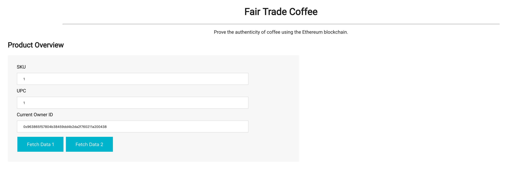

# Supply chain & data auditing

### Quick setup to test and view front-end
```npm install``` ->
```truffle develop``` ->
```truffle test``` ->
```npm run dev```

# Requirement 1: Project write-up - UML

### Activity


### Sequence


### State


### Class (Data Model)


# Requirement 2: Project write-up - Libraries
* Truffle -> allowed for the compiling, migration, and testing of the smart contracts
* web3 -> allowed for connection to the localhost testnet and Rinkeby testnet
* Lite-Server -> allowed for running a localhost webserver to utilize front-end to perform contract operations

# Requirement 3: Project write-up - IPFS
IPFS was not implemented in this project at the moment but it is a great additional add-on for this assignment. It will be added once this entire course is completed.

# Requirement 4: Project write-up - Versions

### Solidity Version
```0.8.1```

### Truffle Version
```5.5.15```

### Node Version
```16.14.2```

### NPM Version
```8.5.0```

### web3 Version
```1.7.3```

# Requirement 5: Project write-up - Contract Addresses and IDs

### SupplyChain.sol
```0xa8Af6748C73FeAFfa1e158D6844681c2f5A74B09```

```0x1891ba4ea249e2b775aa15c9c3dc3642377e89a1aa381af71bf586839a330828```

### FarmerRole.sol
```0x1d0D3c36bB5bC29e5F2B11658e13e1cfa17dC1dA```

```0x8fb35ab8a510ae71a69607d3cf50f7a43f5b633b91ffc71d10276ed0bda3784c```

### DistributorRole.sol
```0x7Dd6b5b2d8b258f9434585920107D3F96011ecd7```

```0xfa499d22665dc907b4166cc5a7e8a98f5ebf00ae48b18ab01653cf8201da7257```

### RetailerRole.sol
```0x0110E4FC2BAcA5da0597BCf1bC661FeA994cf0BF```

```0xf36db098ac1dae596fe9d4d6db161551aadce673a5d4c639eb3876ba1dd01279```

### ConsumerRole.sol
```0x92b1Ce0fF89Fd96EB2FC62288DCeDE8734997e9a```

```0xc2532b476e9ff42700c9a0323018854701b95d93c0b0b6f4d1cb80e35cb29df8```

---

This repository containts an Ethereum DApp that demonstrates a Supply Chain flow between a Seller and Buyer. The user story is similar to any commonly used supply chain process. A Seller can add items to the inventory system stored in the blockchain. A Buyer can purchase such items from the inventory system. Additionally a Seller can mark an item as Shipped, and similarly a Buyer can mark an item as Received.

The DApp User Interface when running should look like...




## Getting Started

These instructions will get you a copy of the project up and running on your local machine for development and testing purposes. See deployment for notes on how to deploy the project on a live system.

### Prerequisites

Please make sure you've already installed ganache-cli, Truffle and enabled MetaMask extension in your browser.

```
Give examples (to be clarified)
```

### Installing

> The starter code is written for **Solidity v0.4.24**. At the time of writing, the current Truffle v5 comes with Solidity v0.5 that requires function *mutability* and *visibility* to be specified (please refer to Solidity [documentation](https://docs.soliditylang.org/en/v0.5.0/050-breaking-changes.html) for more details). To use this starter code, please run `npm i -g truffle@4.1.14` to install Truffle v4 with Solidity v0.4.24. 

A step by step series of examples that tell you have to get a development env running

Clone this repository:

```
git clone https://github.com/udacity/nd1309/tree/master/course-5/project-6
```

Change directory to ```project-6``` folder and install all requisite npm packages (as listed in ```package.json```):

```
cd project-6
npm install
```

Launch Ganache:

```
ganache-cli -m "spirit supply whale amount human item harsh scare congress discover talent hamster"
```

Your terminal should look something like this:


In a separate terminal window, Compile smart contracts:

```
truffle compile
```

Your terminal should look something like this:


This will create the smart contract artifacts in folder ```build\contracts```.

Migrate smart contracts to the locally running blockchain, ganache-cli:

```
truffle migrate
```

Your terminal should look something like this:


Test smart contracts:

```
truffle test
```

All 10 tests should pass.


In a separate terminal window, launch the DApp:

```
npm run dev
```

## Built With

* [Ethereum](https://www.ethereum.org/) - Ethereum is a decentralized platform that runs smart contracts
* [IPFS](https://ipfs.io/) - IPFS is the Distributed Web | A peer-to-peer hypermedia protocol
to make the web faster, safer, and more open.
* [Truffle Framework](http://truffleframework.com/) - Truffle is the most popular development framework for Ethereum with a mission to make your life a whole lot easier.


## Authors

See also the list of [contributors](https://github.com/your/project/contributors.md) who participated in this project.

## Acknowledgments

* Solidity
* Ganache-cli
* Truffle
* IPFS
